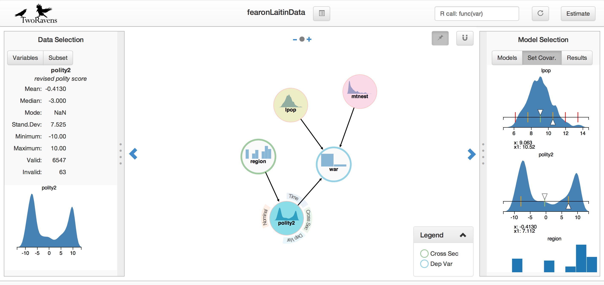

**TwoRavens** is a system of interlocking statistical tools for data exploration, analysis, and meta-analysis.  The first to be released is an interface for quantitative analysis, that allows users at all levels of statistical expertise to explore their data, describe their substantive understanding of the data, and appropriately construct statistical models. This integrates with Dataverse ([Project](http://datascience.iq.harvard.edu/about-dataverse)|[GitHub](https://github.com/IQSS/dataverse)) and Zelig ([Project](http://datascience.iq.harvard.edu/zelig)|[GitHub](https://github.com/IQSS/Zelig5)), through a portable, lightweight, browser-based and gesture-driven interface, allowing users to run statistical models available in Zelig on data archived in Dataverse.

Project page, demos and publications available at: 
http://datascience.iq.harvard.edu/about-tworavens

  

